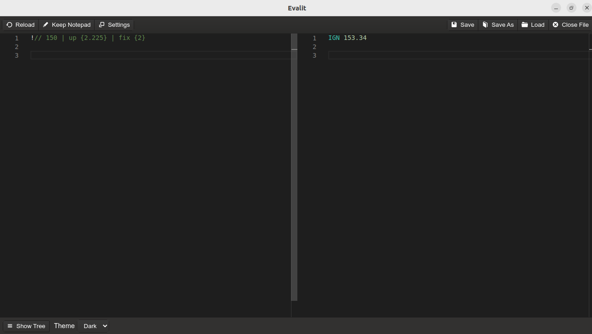

Evalit is a notepad calculator app that allows you to leverage your JavaScript knowledge
to create custom functions. The aim of Evalit is to merge the ease of use of programs like
Soulver and NoteCalc with the deep configurability of spreadsheet programs like
LibreOffice Calc.

Evalit accepts conventional infix notation mathematical expressions with additional syntax
built on top to allow you to define custom functions JavaScript that can be invoked at
runtime using a pipeline operator.

Evalit is not a drop-in replacement for full fledged live computing environments like
Jupyter. Instead, you can think of Evalit as being a step-up from a conventional
calculator apps with additional automation oriented tools.

# Demo for people who can't be bothered to read instructions

In the Evalit appdata directory's "user.defined.functions.js" file:

``` js
var fix  = exp => exp[0].toFixed(exp[1]);             // Round a number to a specific point
var sub  = exp => exp[0] - exp[1];                    // Substract
var up   = exp => exp[0] + (exp[0] * (exp[1] / 100)); // Increase a number by a percentage
var down = exp => exp[0] - (exp[0] * (exp[1] / 100)); // Decrease a number by a percentage

module.exports = {                                    // Export the functions
  fix, sub, up, down
};
```

In the Evalit notepad:

``` js
def @total = 925.548
def @tax   = 5.5

Sub Total
@total . fix {2}

Tax Amount
@total . up {@tax} . sub {@total} . fix {2}

Post-Tax Total
@total . up {@tax} . fix {2}
```

Result in Evalit:


# Instructions

## EvalScript

EvalScript is the syntax that runs within the Evalit notepad. EvalScript is evaluated
line-by-line (similar in effect to a REPL).

There are three values that take into account all evaluated lines at the bottom of the
Evalit GUI:
- Average
- Count
- Sum

The EvalScript syntax allows you to do the following in the notepad:
1. Define constants
2. Chain user defined functions

Define a constant in the notepad:

``` js
def @pi = 3.14
```

Use the defined contant anywhere in the notepad:

``` js
(@pi / 0.5) * 100 // This line will resolve to "628"
```

The function chaining syntax was inspired by the pipeline operator in programming
languages such as Elixir. When you invoke a chained function on a number, the number is
used as the first parameter of the function.


``` js
// user.defined.functions.js file
var up = exp => exp[0] + (exp[0] * (exp[1] / 100));

module.exports = {
  up
};
```

``` js
// Evalit notepad
150 . up {25} // This line will resolve to "187.5"
```

You can also assign the result of mathematical expressions and functions to a constant. To
use a function in a constant assignment, you are required to prefix the assignment with "@
.".

``` js
def @result = @ . (150 / 1.2255) * 2 . up {5.225} . fix {4} // This will assign the value "257.5887" to "@result"

@result * 3.0 . down {25} . fix {2} // This line will resolve to "579.57"
@result * 2.0 . down {15} . fix {2} // This line will resolve to "437.9"
@result * 0.5 . down {15} . fix {2} // This line will resolve to "109.48"
```

EvalScript supports "//" comments for preventing a line from being evaluated. Lines that
do not begin with a numeric value or a "@" will also not be evaluated.

``` js
// This line will not be evaluated; text in this line will be outputed to the read-only editor unchanged.
This line will also not be evaluated.
```

EvalScript allows you to evaluate a line without having its value included in the Count,
Average, and Sum values in the Evalit GUI footer by prefixing the line with "!//". Lines
that are evaluated in this manner will be outputted to the read-only editor with the
prefix "IGN".


