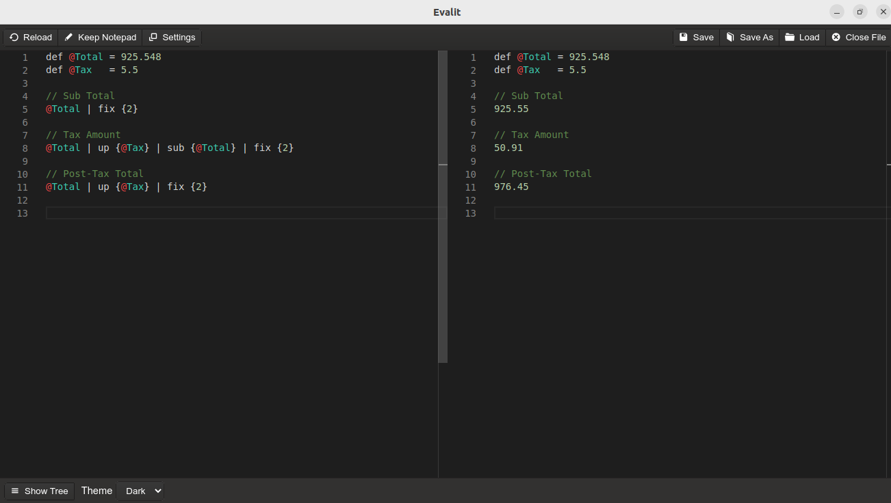

Evalit is a notepad calculator app that allows you to leverage your JavaScript knowledge
to create custom functions. The aim of Evalit is to merge the freedom and ease of use of
programs like Soulver and NoteCalc with the deep configurability of spreadsheet programs
like LibreOffice Calc.

Evalit is not a drop-in replacement for full fledged live computing environments like
Jupyter or Emacs with Org Mode. Instead, you can think of Evalit as being a step-up from
conventional calculator apps that lack automation oriented tools.

Evalit accepts conventional infix notation mathematical expressions (just as you learned
in primary school) with additional syntax built on top to allow users to define custom
functions JavaScript that can be invoked at runtime using a pipeline operator.

The Evalit notepad was built using Microsoft's Monaco editor and has most of the editor's
default functionality builtin. This includes basics such as:
- Multipile cursors
- Search and replace
- Line numbers
- Autocomplete

# Syntax demo for people who can't be bothered to read instructions

In the Evalit appdata directory's "user.defined.functions.js" file:

``` js
var fix  = exp => exp[0].toFixed(exp[1]);             // Round a number to a specific point
var sub  = exp => exp[0] - exp[1];                    // Substract
var up   = exp => exp[0] + (exp[0] * (exp[1] / 100)); // Increase a number by a percentage
var down = exp => exp[0] - (exp[0] * (exp[1] / 100)); // Decrease a number by a percentage

module.exports = {                                    // Export the functions
  fix, sub, up, down
};
```

In the Evalit notepad:

``` js
def @total = 925.548
def @tax   = 5.5

Sub Total
@total . fix {2}

Tax Amount
@total . up {@tax} . sub {@total} . fix {2}

Post-Tax Total
@total . up {@tax} . fix {2}
```

Result in Evalit:



# Instructions

## EvalScript

EvalScript is the syntax that runs within the Evalit notepad. EvalScript is evaluated
line-by-line (similar in effect to a REPL).

There are three values that take into account all evaluated lines at the bottom of the
Evalit GUI:
- Average
- Count
- Sum


The EvalScript syntax allows you to do the following in the notepad:
1. Define constants
2. Chain user defined functions

Define a constant in the notepad:

``` js
def @pi = 3.14
```

Use the defined contant anywhere in the notepad:

``` js
(@pi / 0.5) * 100 // This line will resolve to "628"
```
The function chaining syntax (inspired by the F# pipeline operator) is used to


``` js
// user.defined.functions.js file
var up = exp => exp[0] + (exp[0] * (exp[1] / 100));

module.exports = {
  up
};
```

``` js
// Evalit notepad
150 . up {25} // This line will resolve to "187.5"
```

EvalScript supports "//" comments for preventing a line from being evaluated. Lines that
do not being with a numeric value or a "@" will also not be evaluated.

``` js
// This line will not be evaluated; text in this line will be outputed to the read-only editor unchanged.
This line will also not be evaluated.
```
