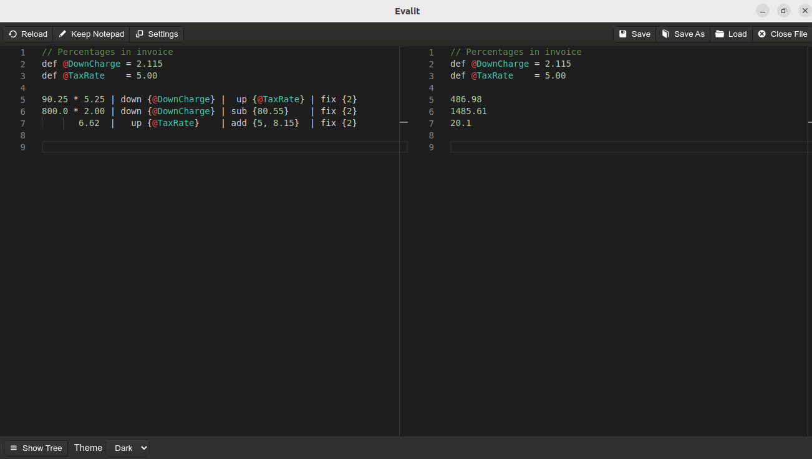

Evalit is a FOSS notepad calculator app that allows you to leverage your JavaScript
knowledge to create custom functions. You can find binaries for Windows 10 (exe installer)
and Linux (AppImage and Snap) on the [release page](https://github.com/MTDonovan/Evalit/releases).



The aim of Evalit is to merge the ease of use of notepad calculator apps like Soulver and
NoteCalc with the configurability of spreadsheet programs like LibreOffice Calc. This is
accomplished by loading two JavaScript files containing user defined modules into the
app's runtime which can then be accessed using the EvalScript syntax.

# Quickstart

In the Evalit appdata > user.defined.functions.js file:

``` js
var fix  = exp => exp[0].toFixed(exp[1]);             // Round a number to a specific point
var sub  = exp => exp[0] - exp[1];                    // Subtract
var up   = exp => exp[0] + (exp[0] * (exp[1] / 100)); // Increase a number by a percentage
var down = exp => exp[0] - (exp[0] * (exp[1] / 100)); // Decrease a number by a percentage

module.exports = {                                    // Export the functions
  fix, sub, up, down
};
```

In the Evalit notepad:

``` js
def @Total = 925.548
def @Tax   = 5.5

// Sub Total
@Total | fix {2}

// Tax Amount
@Total | up {@Tax} | sub {@Total} | fix {2}

// Post-Tax Total
@Total | up {@Tax} | fix {2}
```

Result in Evalit:


# Instructions

## EvalScript

EvalScript is the syntax that runs within the Evalit notepad. EvalScript is evaluated
line-by-line.

The EvalScript syntax allows you to do the following in the notepad:
1. Define variables
2. Chain user defined functions via a pipe syntax

Define a variable in the notepad:

``` js
def @PI = 3.14
```

Use the variable anywhere in the notepad:

``` js
(@PI / 0.5) * 100 // This line will resolve to "628"
```

The function chaining syntax was inspired by the pipe operator in shell scripting. When you invoke a chained function on a number, the number is used as the first parameter of the function and the following parameters are the values passed to the EvalScript function call (i.e., "functionName {param1, param2, etc.}"). You access the individual EvalScript function parameters as indexes of the array in JavaScript.

``` js
// user.defined.functions.js" file
var up = exp => {
    let num = exp[0];        // exp[0] is the number that the function is being called on.
    let percentage = exp[1]; // exp[1] is the first parameter in the EvalScript function parameters (i.e. "up {param1}").
    return num + (num * (percentage / 100));
};

module.exports = {
  up
};
```

``` js
// Evalit notepad
150 | up {25} // This line will resolve to "187.5"
```

You can also assign the result of mathematical expressions and functions to a variable. To
use a function in a variable assignment, you are required to prefix the assignment with "@
|".

``` js
def @Result = @ | (150 / 1.2255) * 2 | up {5.225} | fix {4} // This will assign the value "257.5887" to "@Result"

@Result * 3.0 | down {25} | fix {2} // This line will resolve to "579.57"
@Result * 2.0 | down {15} | fix {2} // This line will resolve to "437.9"
@Result * 0.5 | down {15} | fix {2} // This line will resolve to "109.48"
```

EvalScript supports "//" comments.

``` js
// This line will not be evaluated. Text in this line shall be output to the read-only editor verbatim.
```

Use the "!//" comment syntax to evalute the content of a comment without having the value added to "$sum" totals. These lines shall be output to the read-only editor with the prefix "IGN".


Because all lines are evaluated as JavaScript template literals, you can insert JavaScript snippets into lines.

``` js
${ Math.floor([50.15, 0.899].reduce((x, y) => x + y)) } // This line will resolve to "51"
```

You can use template literals to access the "user.defined.data.js" and "user.defined.functions.js" modules.

``` js
// user.defined.data.js file

var PI = 3.14;     // Define a variable

module.exports = { // Export the $data module
  PI
};
```

``` js
// user.defined.functions.js file

var up = exp => exp[0] + (exp[0] * (exp[1] / 100)); // Create a function

module.exports = {                                  // Export the $fn module
  up
};
```

``` js
// Access the $data module exported from user.defined.data.js
${ $data.PI }            // This line will resolve to "3.14"

// Access the $fn module exported from user.defined.functions.js
${ $fn.up([150, 5.25]) } // This line will resolve to "157.875"
```

# Support

If you like Evalit or other projects that I work on, please consider leaving a tip.

<a href='https://ko-fi.com/K3K0M68XX' target='_blank'></a>
